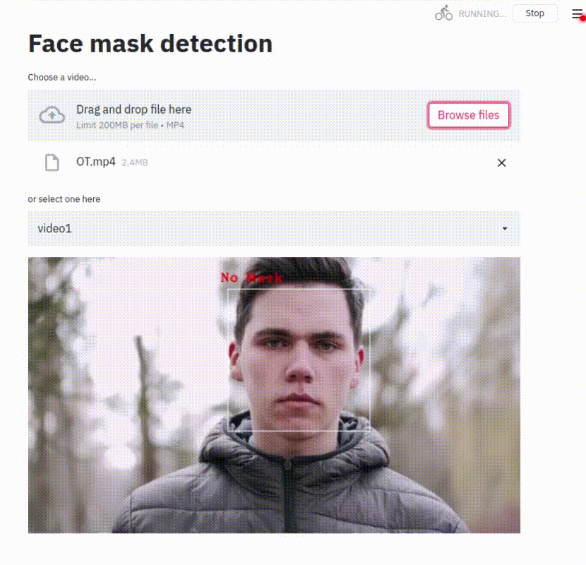

# facemask-detector
Face mask detection on video

## Dependencies
To install all dependencies using pip:
```pip install -r requirements.txt```

## Dataset
To download the dataset, use this GDrive Link: 
https://drive.google.com/file/d/1Lo3dqO6Y2sFrsk5cggVh4hr3RLU3JJRO/view?usp=sharing

## Models
To download the models trained over ResNet and MobileNet, use this GDrive Link:
https://drive.google.com/file/d/1FeHy0FPC28453unUqEEXsSTA6J9Ciz6x/view?usp=sharing

## Training
To train the model, use one of the two Jupyter notebooks

## Inference
For trying out the model on a streamlit web app, run
``` streamlit run test_video_mobilenet.py ```

 